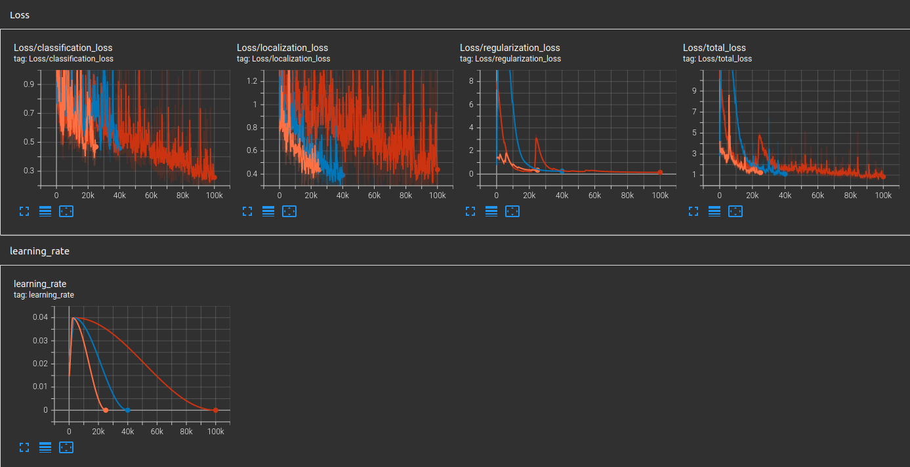

## Submission

### Project overview
This project trains an object detection model on Waymo public data. The goal is to quickly and correctly identify cars, people and bicycles.
Object detection is a crucial part of an autonomous car's system, as it allows to navigate and avoid dangerous situations.

### Set up
What you need to re-run the experiments is: 
* download the Waymo data (description on how to do it is in original project repo) and put it in your home directory (~/Waymo) 
* make sure you've got docker with nvidia-gpu support
* run `run.sh` to build and get terminal on docker container
* run `create_splits.sh` script to split the data into train/test/val datasets
* you can now run `train_reference.sh` to train reference model or `train_test2.sh` to run improved model - results and metrics are located in experiments directory

### Dataset
#### Dataset analysis
Dataset analysis is in `Exploratory Data Analysis.ipynb` notebook. Run `run_jupyter.sh` to view it.

#### Cross validation
Dataset was splitted in such a way, that distributtion of different label classes is similar in every subset. More details are in `Exploratory Data Analysis.ipynb` and in `create_splits.py`.

### Training

Legend:
* orange - reference model
* blue - test 1
* red - test 2

#### Reference experiment
Reference model is a default model with it's configuration generated with `edit_config.py` script.
Results:
* classification_loss = 0.5002
* localization_loss = 0.4074
* regularization_loss = 0.3422
* total_loss = 1.25

#### Improve on the reference
Approach taken to improve model performence consisted of adding more data augmentation steps (so the model could generalize better), adding nn layer and increasing training steps so it can converge better.
The results are located in directory `experiments/test2`
The model improved its performance:
* classification_loss = 0.268
* localization_loss = 0.5031
* regularization_loss = 0.1506
* total_loss = 0.9217
