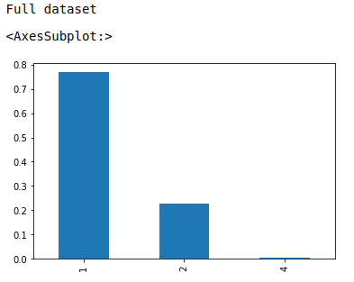
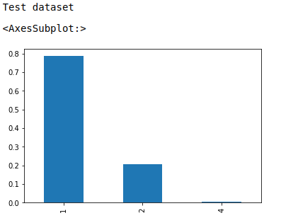
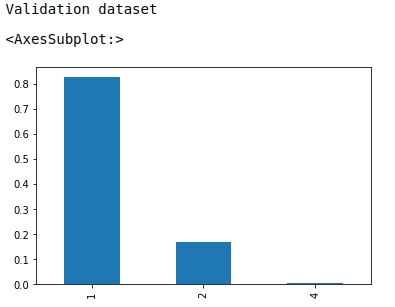
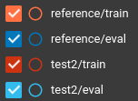
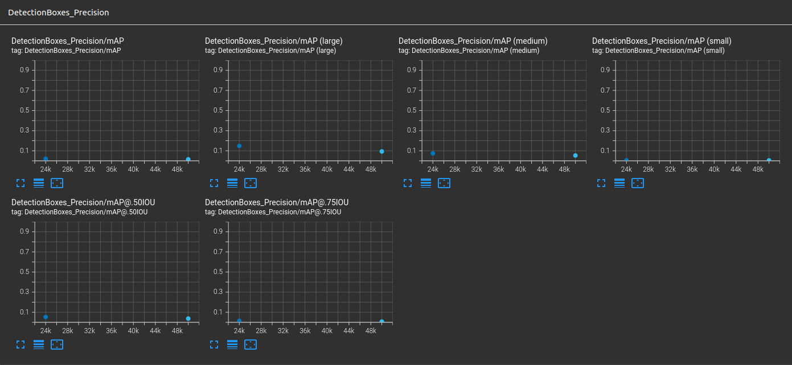
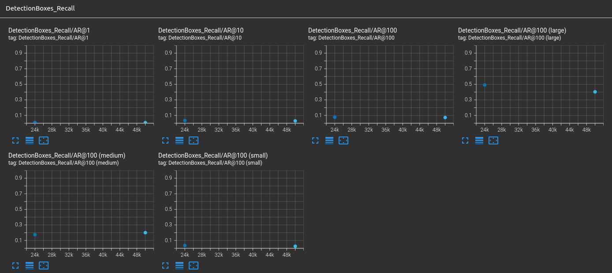
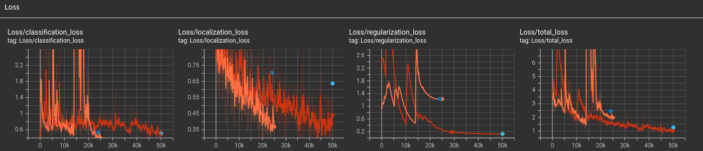

# Submission

## Project overview

This project trains an object detection model on Waymo public data. The goal is to quickly and correctly identify cars, people and bicycles.
Object detection is a crucial part of an autonomous car's system, as it allows to navigate and avoid dangerous situations.

## Set up

What you need to re-run the experiments is: 
* download the Waymo data (description on how to do it is in original project repo) and put it in your home directory (~/Waymo) 
* make sure you've got docker with nvidia-gpu support
* run `run.sh` to build and get terminal on docker container
* run `create_splits.sh` script to split the data into train/test/val datasets
* you can now run `train_reference.sh` to train reference model or `train_test2.sh` to run improved model - results and metrics are located in experiments directory

## Dataset

### Dataset analysis

Dataset analysis is in `Exploratory Data Analysis.ipynb` notebook. Run `run_jupyter.sh` to view it.

### Cross validation

Dataset consists of 3 label classes:
* 1 - vehicle
* 2 - pedestrian
* 4 - cyclist

Here's a distribution of label classes in a full dataset:

As we can see the dataset is inbalanced. Dealing with imbalance by applying weights might improve preformance.

Dataset was splitted in such a way, that distributtion of different label classes is similar in every subset and most similar to the original dataset. 

Below are distribution of splitted dataset. They were splitten in 80/10/10 ratio.

More details are in `Exploratory Data Analysis.ipynb` and in `create_splits.py`.

## Training

### Reference experiment

Reference model is a default model with it's configuration generated with `edit_config.py` script.
As we can see in a plot above the model is converging (all of the loses are decreasing) and it didn't reached a plateau. 
It might be a good idea to increase training epoch to converge better. 
We must however make sure we don't overfit - so adding more data augmentation steps could help it generalise better.
The results are located in directory `experiments/reference`

### Improve on the reference

Approach taken to improve model performence consisted of adding more data augmentation steps (so the model could generalize better), adding nn layer and increasing training steps so it can converge better.
Augmentation steps exploration can be found in `Explore augmentations.ipynb` notebook.
The results are located in directory `experiments/test2`

Data augmentation steps used:
* random_horizontal_flip
* random_crop_image
* random_jitter_boxes
* random_black_patches
* random_adjust_brightness
* random_adjust_contrast
* random_adjust_hue
* random_adjust_saturation
* random_distort_color
* random_crop_to_aspect_ratio
